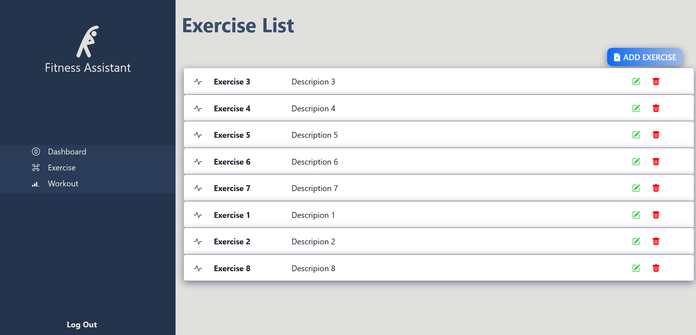
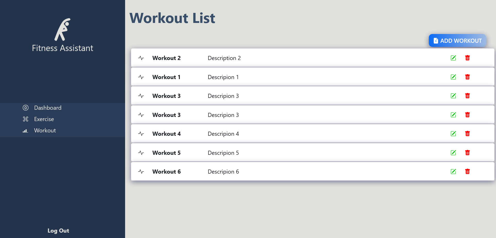
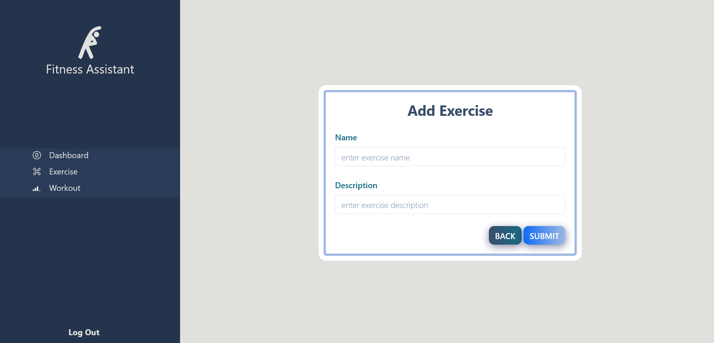
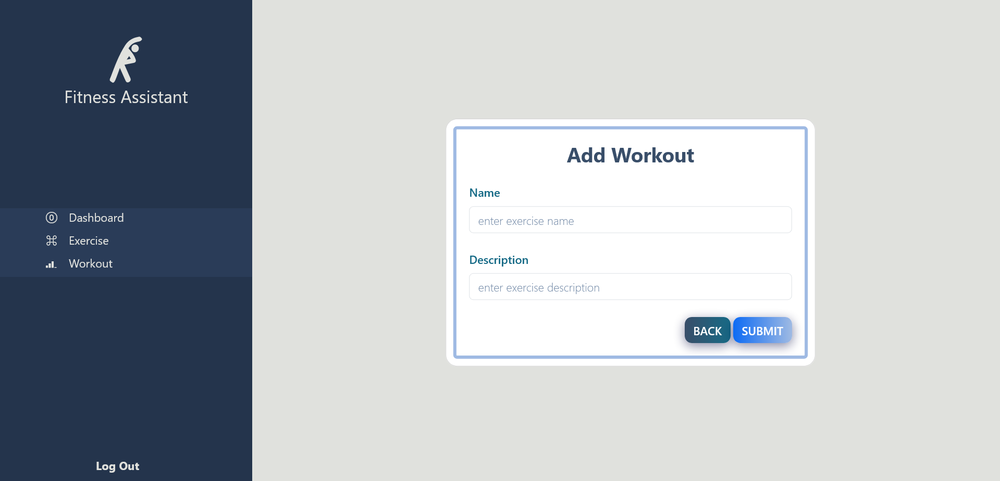
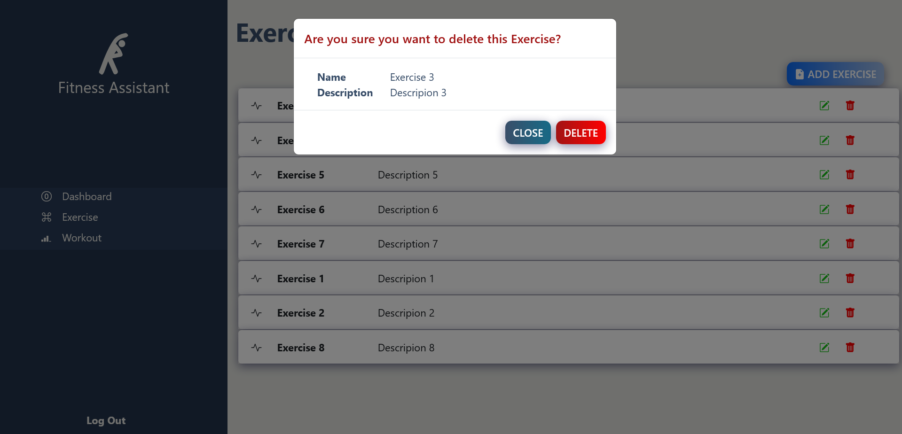
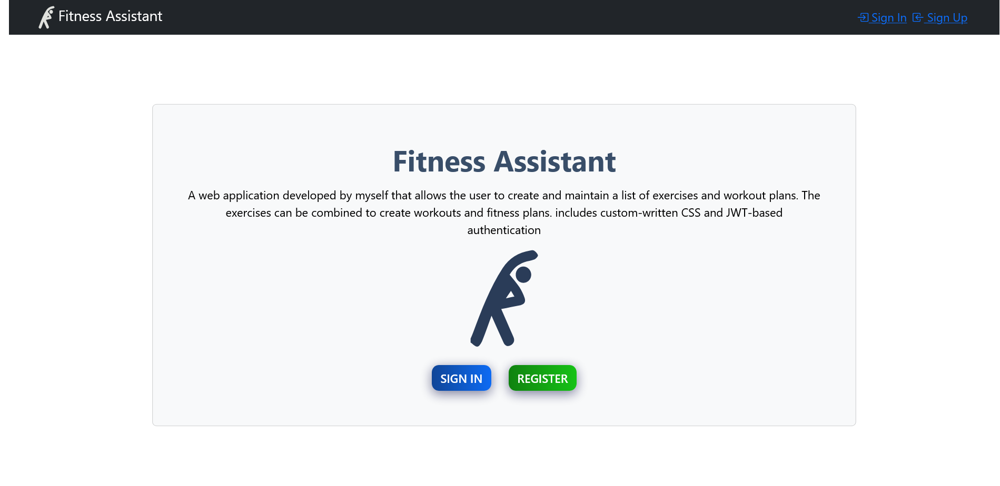
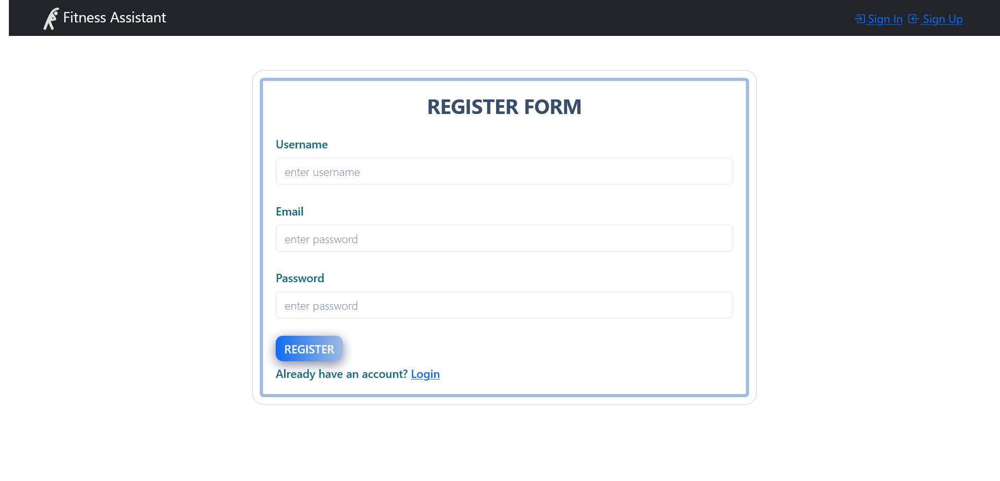

# TaskZen task management application
A web application developed by myself that allows the user to create and maintain a list of exercises and workout plans. The exercises can be combined to create workouts and fitness plans. includes custom-written CSS and JWT-based authentication

## Screenshots

### Exercise List Page View

### Workout List Page View

### Add Exercise Page View

### Add Exercise Page View

### Add Exercise Page View

### DeletePopup View

### Home Page View

### Sign Up Page View

### Sign In Page View

